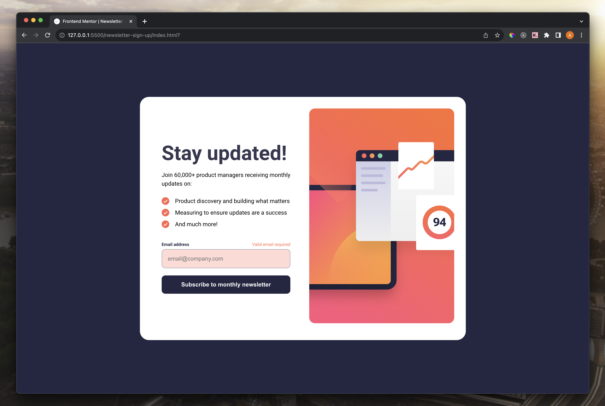

# Frontend Mentor - Newsletter sign-up form with success message solution

This is a solution to the [Newsletter sign-up form with success message challenge on Frontend Mentor](https://www.frontendmentor.io/challenges/newsletter-signup-form-with-success-message-3FC1AZbNrv).

## Overview

I wrote this solution using Vanilla JS and SCSS. The email signup input undergoes sanitization and validation. Also there is helper text and error states for incorrect email address input or lack of input on submission.

### The challenge

Users should be able to:

- Add their email and submit the form
- See a success message with their email after successfully submitting the form
- See form validation messages if:
  - The field is left empty
  - The email address is not formatted correctly
- View the optimal layout for the interface depending on their device's screen size
- See hover and focus states for all interactive elements on the page

### Screenshot

### Preview

- Live Site URL: [https://adamrichardturner.github.io/newsletter-sign-up](https://adamrichardturner.github.io/newsletter-sign-up)

### Built with

- Vanilla JavaScript
- Semantic HTML5 markup
- Sass
- Flexbox
- Mobile-first workflow